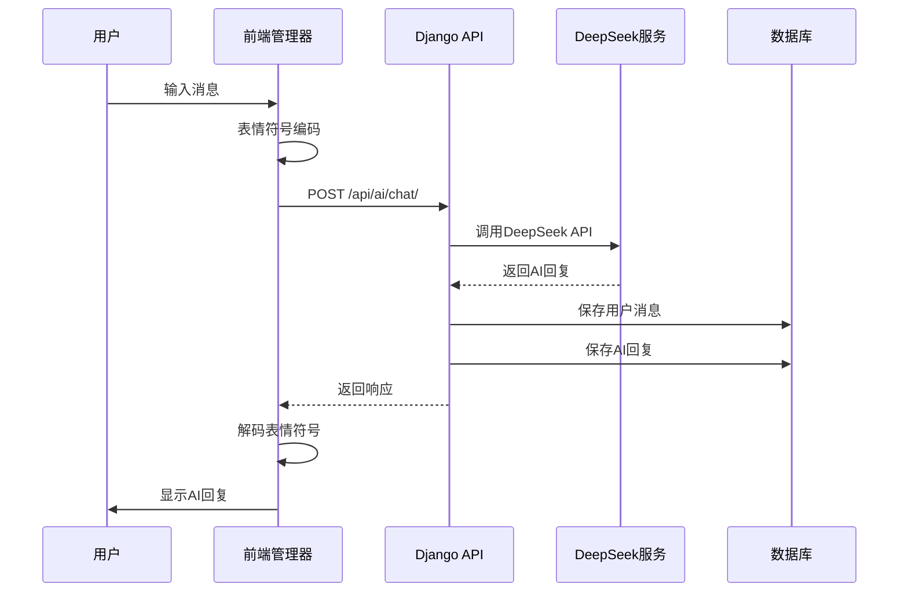
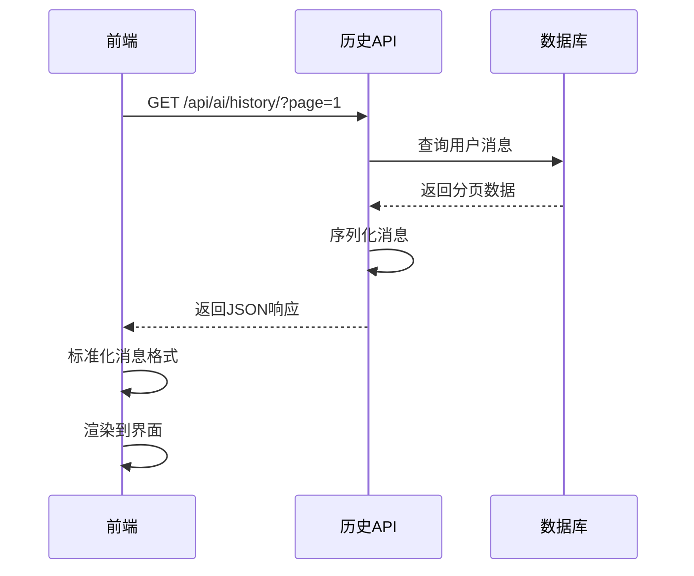
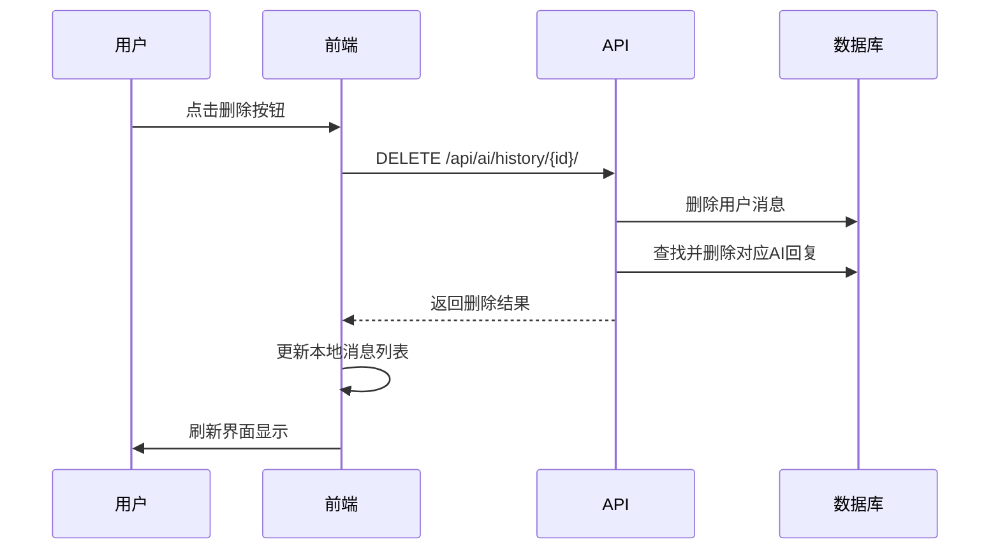

# AI助手聊天系统架构分析

## 🎯 系统概述

这是一个基于Django的产业链态势感知系统中的AI聊天功能实现，使用DeepSeek模型提供智能问答服务。系统采用前后端分离的架构，支持实时聊天、历史记录管理、会话持久化等功能。

## 📁 文件结构总览

```
data_hall/
├── ai_views.py           # AI聊天API视图（616行）
├── ai_services.py        # AI服务层逻辑（334行）
├── ai_serializers.py     # DRF序列化器（188行）
├── models.py            # 数据模型（含ChatMessage）
├── emoji_utils.py       # 表情符号处理工具
├── templates/data_hall/
│   ├── base.html        # 主页面模板
│   ├── index.html       # 首页模板
│   ├── index_iframe.html # 首页iframe版本
│   ├── chat_widget_standalone.html # 独立聊天窗口
│   └── components/
│       └── ai_chat_widget.html # AI聊天组件
└── static/data_hall/
    ├── css/
    │   ├── ai_chat_widget.css    # AI聊天样式（1838行）
    │   └── chat.css              # 基础聊天样式
    └── js/
        ├── ai-chat.js            # 核心AI聊天管理器（742行）
        ├── ai-assistant/
        │   ├── index.js          # 首页AI助手管理器（666行）
        │   └── sync.js           # 聊天记录同步管理器（409行）
        └── chat-storage.js       # 本地存储管理器
```

## 🏗️ 系统架构

### 整体架构图

```
┌─────────────────┐    ┌─────────────────┐    ┌─────────────────┐
│   前端界面层    │    │   业务逻辑层    │    │   数据存储层    │
├─────────────────┤    ├─────────────────┤    ├─────────────────┤
│ • 首页AI搜索    │    │ • AI视图层      │    │ • ChatMessage   │
│ • 悬浮聊天窗口  │◄──►│ • AI服务层      │◄──►│ • MySQL数据库   │
│ • 全屏聊天界面  │    │ • 序列化层      │    │ • 用户认证      │
│ • 历史记录管理  │    │ • 权限控制      │    │ • 会话管理      │
└─────────────────┘    └─────────────────┘    └─────────────────┘
         ▲                       ▲                       ▲
         │                       │                       │
         ▼                       ▼                       ▼
┌─────────────────┐    ┌─────────────────┐    ┌─────────────────┐
│   客户端管理    │    │   外部API       │    │   配置管理      │
├─────────────────┤    ├─────────────────┤    ├─────────────────┤
│ • AIChatManager │    │ • DeepSeek API  │    │ • Django配置    │
│ • SyncManager   │    │ • REST接口      │    │ • 环境变量      │
│ • IndexManager  │    │ • 认证令牌      │    │ • 系统提示词    │
└─────────────────┘    └─────────────────┘    └─────────────────┘
```

## 🔧 后端实现

### 1. 数据模型 (`models.py`)

#### ChatMessage模型
```python
class ChatMessage(models.Model):
    """聊天消息模型"""
    user = models.ForeignKey(User, on_delete=models.CASCADE)
    role = models.CharField(max_length=20, choices=[('user', '用户'), ('assistant', 'AI助手')])
    content = models.TextField('消息内容')
    created_at = models.DateTimeField(auto_now_add=True)
    session_id = models.CharField(max_length=100, blank=True, null=True)
    metadata = models.JSONField(blank=True, null=True)
```

**特性：**
- 用户关联：每条消息都与用户绑定
- 角色区分：区分用户消息和AI回复
- 会话支持：通过session_id支持多会话管理
- 元数据存储：JSON字段存储额外信息（模型版本、耗时等）
- 索引优化：为用户、时间、会话等建立复合索引

### 2. API视图层 (`ai_views.py`)

#### 核心API接口

| 接口 | 方法 | 功能 | 权限 |
|------|------|------|------|
| `/api/ai/chat/` | POST | 发送消息获取AI回复 | AllowAny |
| `/api/ai/history/` | GET | 获取聊天历史（分页） | IsAuthenticated |
| `/api/ai/history/` | POST | 保存聊天记录 | IsAuthenticated |
| `/api/ai/history/` | DELETE | 清空聊天历史 | IsAuthenticated |
| `/api/ai/history/<id>/` | DELETE | 删除单条记录 | IsAuthenticated |
| `/api/ai/history/<id>/` | PUT | 更新单条记录 | IsAuthenticated |
| `/api/ai/config/` | GET | 获取AI配置信息 | AllowAny |
| `/api/ai/health/` | GET | 健康检查 | AllowAny |

#### 关键特性
- **分页支持**：聊天历史使用自定义分页器，每页10-50条记录
- **CSRF保护**：所有修改操作都需要CSRF令牌
- **错误处理**：统一的错误响应格式和日志记录
- **权限控制**：读写操作需要用户认证，匿名用户只能聊天

### 3. AI服务层 (`ai_services.py`)

#### DeepSeekChatService类
```python
class DeepSeekChatService:
    """DeepSeek聊天服务"""
    def __init__(self):
        self.client = OpenAI(api_key=DEEPSEEK_API_KEY, base_url=DEEPSEEK_BASE_URL)
    
    def chat_completion(self, user_message, conversation_history=None):
        """同步聊天完成"""
    
    async def chat_completion_async(self, user_message, conversation_history=None):
        """异步聊天完成"""
```

**功能特性：**
- 支持对话历史上下文
- 同步/异步两种调用模式
- 完整的错误处理和重试机制
- 配置参数化（temperature、max_tokens等）
- 统一的响应格式化

#### ChatMessageProcessor类
```python
class ChatMessageProcessor:
    """聊天消息处理器"""
    @staticmethod
    def parse_user_input(request_data)  # 解析用户输入
    @staticmethod
    def extract_conversation_history(request_data)  # 提取对话历史
    @staticmethod
    def prepare_message_for_storage(content)  # 准备存储消息
    @staticmethod
    def prepare_message_for_display(content)  # 准备显示消息
```

### 4. 配置管理 (`settings.py`)

```python
# DeepSeek API配置
DEEPSEEK_API_KEY = os.getenv('DEEPSEEK_API_KEY', '')
DEEPSEEK_BASE_URL = 'https://api.deepseek.com'
DEEPSEEK_MODEL = 'deepseek-chat'
DEEPSEEK_MAX_TOKENS = 1000
DEEPSEEK_TEMPERATURE = 0.7
DEEPSEEK_SYSTEM_PROMPT = '你是一个产业研究智能助手...'
```

## 🎨 前端实现

### 1. 核心JavaScript架构

#### 三层管理器架构

```javascript
// 1. 核心AI聊天管理器 (ai-chat.js)
class AIChatManager {
    // 负责与后端API交互、消息管理、状态控制
}

// 2. 首页AI助手管理器 (ai-assistant/index.js)
class AIAssistantIndexManager {
    // 负责首页AI搜索覆盖层的交互逻辑
}

// 3. 聊天记录同步管理器 (ai-assistant/sync.js)
class ChatSyncManager {
    // 负责聊天记录与后端数据库的同步
}
```

#### 智能路由机制

```
用户操作 → AIAssistantIndexManager → 
{
  成功: ChatSyncManager → 后端API → 数据库
  失败: AIChatManager → 本地处理 → 降级体验
}
```

### 2. AIChatManager详细分析

#### 核心功能模块
```javascript
class AIChatManager {
    constructor(options = {}) {
        // 配置管理
        this.apiUrl = '/api/ai/chat/';
        this.historyUrl = '/api/ai/history/';
        this.systemPrompt = '产业研究智能助手...';
        
        // 状态管理
        this.messages = [];
        this.isWaitingForResponse = false;
        this.currentPage = 0;
        this.hasMoreMessages = true;
    }
    
    // 核心方法
    async initialize()                    // 初始化聊天历史
    async loadChatHistory()               // 分页加载历史
    async sendMessage(message)            // 发送消息
    async deleteMessagePair()             // 删除消息对
    async updateMessage()                 // 更新消息
    async clearAllMessages()              // 清空记录
    async regenerateResponse()            // 重新生成回复
}
```

#### 消息处理流程
```javascript
sendMessage() → {
    1. 表情符号编码处理
    2. 构建请求上下文（历史消息）
    3. 发送API请求到后端
    4. 处理AI响应
    5. 更新本地消息状态
    6. 触发UI更新
}
```

#### 表情符号处理机制
```javascript
// 发送时编码
encodeEmojis(text) {
    return text.replace(/[\u{1F600}-\u{1F64F}]/gu, 
        match => '&#' + match.codePointAt(0) + ';');
}

// 显示时解码
decodeEmojis(text) {
    return text.replace(/&#(\d+);/g, 
        (match, dec) => String.fromCodePoint(dec));
}
```

### 3. ChatSyncManager详细分析

#### 后端同步功能
```javascript
class ChatSyncManager {
    // 聊天历史操作
    async loadChatHistory(page, pageSize)          // 分页加载
    async saveChatMessage(role, content)           // 保存消息
    async deleteChatMessage(messageId)             // 删除消息
    async updateChatMessage(messageId, content)    // 更新消息
    async clearAllChatHistory()                    // 清空历史
    
    // 高级功能
    async sendMessageWithAutoSave()               // 发送并自动保存
    async regenerateResponse()                     // 重新生成并保存
}
```

#### 错误处理与降级
```javascript
async sendMessageWithAutoSave(message) {
    try {
        // 尝试使用同步版本
        const result = await this.sendChatMessage(message);
        await this.saveChatMessage('user', message);
        await this.saveChatMessage('assistant', result.response);
        return result;
    } catch (error) {
        console.warn('同步版本失败，降级到本地AI管理器');
        // 降级到本地处理
        return await window.aiChatManager.sendMessage(message);
    }
}
```

### 4. AIAssistantIndexManager详细分析

#### 首页整合功能
```javascript
class AIAssistantIndexManager {
    // UI状态管理
    openSearchOverlay()      // 打开AI搜索覆盖层
    closeSearchOverlay()     // 关闭搜索覆盖层
    
    // 交互处理
    handleSearchSubmit()     // 处理搜索提交
    handleRecommendationClick() // 处理推荐问题点击
    
    // 数据展示
    loadTopCompanies()       // 加载新势力企业数据
    renderMessage()          // 渲染聊天消息
}
```

#### 企业数据整合
```javascript
async loadTopCompanies() {
    const response = await fetch('/api/top-companies/');
    const companies = await response.json();
    this.renderTopCompaniesTable(companies.slice(0, 10));
}
```

## 🎯 样式系统分析

### 1. 主样式文件 (`ai_chat_widget.css` - 1838行)

#### 响应式设计
```css
/* 桌面端 */
#ai-chat-widget {
    position: fixed;
    bottom: 1.5rem;
    right: 1rem;
}

/* 平板端 (≤768px) */
@media (max-width: 768px) {
    #ai-chat-widget {
        bottom: 1rem;
        right: 0.5rem;
    }
}

/* 手机端 (≤480px) */
@media (max-width: 480px) {
    #ai-chat-widget {
        bottom: 0.5rem;
        right: 0.5rem;
    }
}
```

#### 磨玻璃效果设计
```css
#chat-window {
    backdrop-filter: blur(16px) saturate(120%) brightness(1.05);
    background: linear-gradient(145deg, 
        rgba(0, 32, 64, 0.88) 0%, 
        rgba(0, 40, 80, 0.85) 50%,
        rgba(0, 28, 60, 0.90) 100%);
    box-shadow: 
        0 20px 60px rgba(0, 0, 0, 0.3),
        0 8px 25px rgba(0, 0, 0, 0.2),
        0 0 0 1px rgba(0, 191, 255, 0.15);
}
```

#### 动画系统
```css
/* 窗口进入动画 */
@keyframes windowEnter {
    0% { opacity: 0; transform: scale(0.8) translateY(20px); }
    60% { opacity: 1; transform: scale(1.05) translateY(-5px); }
    100% { opacity: 1; transform: scale(1) translateY(0); }
}

/* 消息输入动画 */
@keyframes messageSlideIn {
    0% { opacity: 0; transform: translateY(10px); }
    100% { opacity: 1; transform: translateY(0); }
}

/* 思考动画 */
@keyframes typingAnimation {
    0%, 60%, 100% { transform: translateY(0); }
    30% { transform: translateY(-10px); }
}
```

### 2. 交互状态设计

#### 按钮状态管理
```css
/* 发送按钮状态 */
#send-btn:hover:not(:disabled) {
    background: linear-gradient(135deg, #0ea5e9 0%, #3b82f6 100%);
    transform: translateY(-1px);
}

#send-btn:disabled {
    opacity: 0.6;
    cursor: not-allowed;
}

/* 发送中状态 */
.send-btn-sending svg {
    animation: rotate 1s linear infinite;
}
```

#### 消息悬停操作
```css
.message-hover-actions {
    position: absolute;
    right: -8px;
    top: 50%;
    transform: translateY(-50%);
    opacity: 0;
    transition: all 0.2s ease;
}

.chat-message-ai:hover .message-hover-actions {
    opacity: 1;
    transform: translateY(-50%) translateX(0);
}
```

## 🔄 请求/响应流程

### 1. 用户发送消息流程



### 2. 历史记录加载流程



### 3. 消息删除流程



## 🛡️ 安全与性能

### 1. 安全措施

#### CSRF保护
```javascript
getCSRFToken() {
    const metaToken = document.querySelector('meta[name="csrf-token"]');
    if (metaToken) return metaToken.getAttribute('content');
    
    const cookies = document.cookie.split(';');
    for (let cookie of cookies) {
        const [name, value] = cookie.trim().split('=');
        if (name === 'csrftoken') return decodeURIComponent(value);
    }
    return '';
}
```

#### XSS防护
```javascript
// 使用DOMPurify库清理HTML内容
const cleanHTML = DOMPurify.sanitize(marked.parse(message));
```

#### 权限控制
```python
# API权限设置
class ChatHistoryAPIView(APIView):
    permission_classes = [IsAuthenticated]  # 需要登录
    
class AIChatAPIView(APIView):
    permission_classes = [AllowAny]  # 允许匿名聊天
```

### 2. 性能优化

#### 分页加载
```javascript
// 聊天历史分页加载
async loadChatHistory(isInitialLoad = false) {
    if (!isInitialLoad && !this.hasMoreMessages) return;
    
    const targetPage = isInitialLoad ? 1 : this.currentPage + 1;
    // 每次只加载10条记录
}
```

#### 请求节流
```javascript
// 防止重复请求
if (this.isWaitingForResponse) {
    console.warn('已有请求正在处理中...');
    return null;
}
this.isWaitingForResponse = true;
```

#### 本地缓存
```javascript
// 消息本地缓存
this.messages = [...this.messages]; // 防止外部修改
```

## 🔮 扩展功能

### 1. 会话管理系统（预留）

```javascript
window.sessionManagement = {
    // 会话管理功能接口（已预留）
    openSessionManager() {
        console.log('打开会话管理窗口');
    },
    createNewSession() {
        console.log('创建新会话');
    },
    switchSession(sessionId) {
        console.log(`切换到会话: ${sessionId}`);
    },
    deleteSession(sessionId) {
        console.log(`删除会话: ${sessionId}`);
    },
    renameSession(sessionId, newName) {
        console.log(`重命名会话 ${sessionId} 为: ${newName}`);
    }
};
```

### 2. 多模型支持扩展

```python
# 在settings.py中可配置多个AI模型
AI_MODELS = {
    'deepseek': {
        'api_key': os.getenv('DEEPSEEK_API_KEY'),
        'base_url': 'https://api.deepseek.com',
        'model': 'deepseek-chat'
    },
    'openai': {
        'api_key': os.getenv('OPENAI_API_KEY'),
        'base_url': 'https://api.openai.com/v1',
        'model': 'gpt-3.5-turbo'
    }
}
```

## 📝 开发指南

### 1. 快速上手

#### 环境配置
```bash
# 设置DeepSeek API密钥
export DEEPSEEK_API_KEY="your_api_key_here"

# 运行数据库迁移
python manage.py migrate

# 启动开发服务器
python manage.py runserver
```

#### 测试AI功能
```javascript
// 在浏览器控制台测试
if (window.aiChatManager) {
    window.aiChatManager.sendMessage('你好，请介绍一下新势力企业');
}
```

### 2. 常见开发任务

#### 添加新的AI助手功能
1. 在`ai_views.py`中创建新的API视图
2. 在`urls.py`中添加路由
3. 在前端管理器中添加对应方法
4. 更新UI模板和样式

#### 修改AI模型配置
1. 更新`settings.py`中的`DEEPSEEK_*`配置
2. 重启Django服务器
3. 清除浏览器缓存测试

#### 自定义聊天界面
1. 修改`ai_chat_widget.css`样式文件
2. 更新HTML模板结构
3. 调整JavaScript交互逻辑

### 3. 调试技巧

#### 后端调试
```python
# 在ai_views.py中添加日志
import logging
logger = logging.getLogger('ai_chat')
logger.info(f"用户消息: {user_message}")
```

#### 前端调试
```javascript
// 在浏览器控制台查看状态
console.log('当前消息数量:', window.aiChatManager.messages.length);
console.log('等待响应状态:', window.aiChatManager.isWaitingForResponse);
```

## 📊 系统监控

### 1. 关键指标

- **API响应时间**：DeepSeek API调用耗时
- **消息处理量**：每分钟处理的消息数量
- **错误率**：API调用失败率
- **用户活跃度**：活跃聊天用户数

### 2. 日志记录

```python
# ai_views.py中的日志配置
logger = logging.getLogger('ai_chat')

# 记录关键操作
logger.info(f"用户 {request.user.username} 发送消息")
logger.error(f"DeepSeek API调用失败: {str(e)}")
```

## 🚀 部署注意事项

### 1. 生产环境配置

```python
# settings.py生产环境配置
DEBUG = False
ALLOWED_HOSTS = ['your-domain.com']

# 安全设置
SECURE_SSL_REDIRECT = True
CSRF_COOKIE_SECURE = True
SESSION_COOKIE_SECURE = True

# DeepSeek API密钥（必须设置）
DEEPSEEK_API_KEY = os.getenv('DEEPSEEK_API_KEY')
if not DEEPSEEK_API_KEY:
    raise ValueError("必须设置DEEPSEEK_API_KEY环境变量")
```

### 2. 静态文件处理

```bash
# 收集静态文件
python manage.py collectstatic

# 配置Nginx服务静态文件
location /static/ {
    alias /path/to/static/files/;
    expires 1y;
    add_header Cache-Control "public, immutable";
}
```

### 3. 数据库优化

```python
# 为ChatMessage模型添加索引
class ChatMessage(models.Model):
    class Meta:
        indexes = [
            models.Index(fields=['user', '-created_at']),
            models.Index(fields=['session_id']),
        ]
```

---

**总结**：这个AI助手聊天系统具有完整的前后端架构，支持实时聊天、历史管理、会话持久化等功能。代码结构清晰，扩展性强，适合作为企业级AI聊天解决方案的基础。 